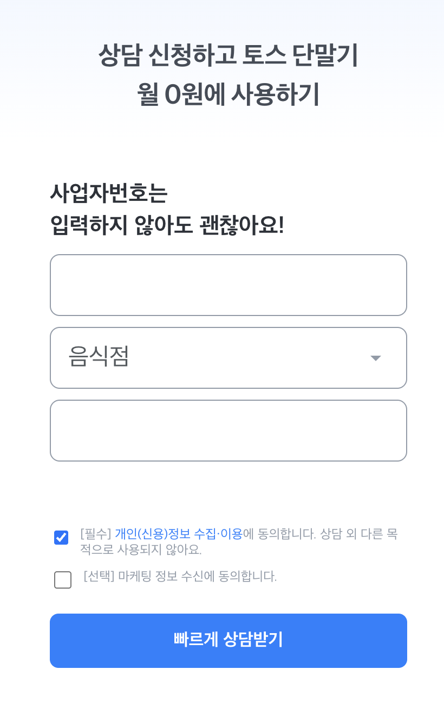

# 아이샵케어 Full Stack Developer (Node.js) 사전 과제

구매 상담 정보를 받아서 저장하고, 내부 Admin에서 검색/필터 조회하는 기능을 제공하는 API 서버 어플리케이션을 구현해주세요.

## 📌 제약 사항

- 🟦 **TypeScript**로 구현해 주세요.
- 🧱 기존 `ishopcare-preview-test` 레포의 코드 베이스를 활용하되, 자유롭게 수정하셔도 괜찮습니다. 단, **NestJS 아키텍처**는 가능하면 적극 활용해 주세요.
- 🤔 위 조건 외에는 **개인 판단**에 따라 효율적인 방식으로 구현해 주세요. **모든 지원자 분들께 동일한 경험을 제공해 드리기 위해, 개별적인 과제 관련 문의 사항은 답변 드리기 어려움을 양해 부탁 드립니다.**

## ⚙️ 과제 템플릿 초기 세팅 방법

- 📦 `pnpm install` 를 통해 의존성 패키지를 설치합니다.
- 🔧 본 과제 템플릿은 **Node.js 20** 버전에서 작성되었습니다. `Node 20` 이상 버전을 사용하길 권장드립니다.
- 🧬 `pnpm schema:generate` 실행 시 `sqlite3` 파일이 생성됩니다. `inquiry-entity.ts` 코드를 수정한 경우, 해당 명령어로 스키마를 업데이트해주세요.
- 🚀 `pnpm start:dev` 를 통해 서버 및 배치 작업을 실행시킵니다. http://localhost:8081/api-docs에 접속하면 swagger 문서를 확인할 수 있습니다.

## 📦 과제 템플릿 구조

```txt
📦src
 ┣ 📂api
 ┃ ┣ 📂internal : 내부 Admin 용 API
 ┃ ┃ ┣ 📜internal-api.controller.ts
 ┃ ┃ ┣ 📜internal-api.module.ts
 ┃ ┃ ┗ 📜internal-api.service.ts
 ┃ ┗ 📂public : 구매 상담 정보 입력 페이지용 Public API
 ┃ ┃ ┣ 📜public-api.controller.ts
 ┃ ┃ ┣ 📜public-api.module.ts
 ┃ ┃ ┗ 📜public-api.service.ts
 ┣ 📂mikro-orm : DB 관련 모듈
 ┃ ┣ 📂entities
 ┃ ┃ ┗ 📂inquiry
 ┃ ┃ ┃ ┣ 📜inquiry-entity.ts
 ┃ ┃ ┃ ┣ 📜inquiry-repository.module.ts
 ┃ ┃ ┃ ┗ 📜inquiry-repository.ts
 ┃ ┣ 📂scripts
 ┃ ┃ ┗ 📜schema-generator.ts
 ┃ ┗ 📜const.ts
 ┣ 📜app.module.ts
 ┗ 📜main.ts
```

## 과제 요구사항

- Mission : 구매 상담 정보를 받아서 저장하고, 내부 Admin에서 검색/필터 조회하는 기능을 제공하는 API 서버 어플리케이션을 구현해주세요.
  - 아래 항목 중 "✅ 필수 사항" 부터 구현해주시면 좋습니다. 필수 사항 마무리 후 "🟡 선택 사항" 까지 고려해서 개발해주시면 좋습니다.
  - 아래 요구사항에 대한 구현 외에도 확장성/유지보수성을 고려한 지원자 분의 코드 스타일을 파악하기 위한 목적의 과제입니다. 파일 디렉토리 구조를 본인의 코드 스타일에 맞게 자유롭게 바꿔주셔도 좋고, 아래 요구사항 외에도 어필하시고 싶으신 부분을 자유롭게 추가 구현해주셔도 좋습니다.
  - 구현 의도 및 어필하시고 싶으신 부분이 있다면 README.md 파일 하단에 자유 양식으로 작성해서 제출해주시면 평가시 참고하겠습니다.

- Step 1. 구매 상담 등록 API
  - 
  - ✅ `src/api/public` 디렉토리에서 작업을 시작해주시면 됩니다.
  - ✅ 페이지의 입력 값들을 참고해서 `[POST] /public/inquiry` API의 body를 정의해주세요. 입력 값을 저장할 수 있도록 적합한 필드명을 정의해서 `mikro-orm/entities/inquiry` 내부를 구현해주세요.
  - ✅ 제출한 코드에서 API 호출시 DB에 구매 상담 문의가 정상적으로 저장되는지 여부가 가장 중요합니다.
  - ✅ 고객이 입력한 전화번호는 민감정보로 간주됩니다. DB에 저장 시 평문으로 저장되지 않도록 암호화하여 저장하고, 조회 시에는 복호화된 값이 반환되도록 설계해주세요. 암호화 키는 안전하게 관리되어야 하며, 하드코딩은 피해주세요.
    - 민감정보는 고객의 모든 개인정보(이름, 전화번호, 주소, 이메일 등)에 해당하며 추후 다른 컬럼들에도 암호화하여 저장할 예정입니다. 확장성을 고려해서 구현해주세요.
  - 🟡 유효하지 않은 전화번호인 경우 `400 Bad Request` 오류가 뜨도록 해주세요. 유효한 전화번호를 판별하는 로직을 가능한 디테일하게 구현해주세요. (참고 : https://namu.wiki/w/010#s-3)

- Step 2. 내부 Admin 구매 상담 조회 API
  - Step 1을 통해 저장한 구매 상담 내역을 내부 Admin에서 조회하기 위한 API를 구현해주신다고 생각하시면 됩니다.
  - ✅ `src/api/internal` 디렉토리에서 작업을 시작해주시면 됩니다.
  - ✅ 전화번호로 검색할 수 있도록 `[GET] /interal/inquiries` API의 query를 정의해주세요. 저장된 내역을 검색해서 조회할 수 있도록 `mikro-orm/entities/inquiry` 내부를 구현해주세요.
  - ✅ 제출한 코드에서 API 호출시 전화번호를 기반으로 적합한 내역만 조회되는지 여부가 가장 중요합니다. (ex: 010-1234-1234 번호만 조회)
  - 🟡 구매 상담 내역의 등록 시간을 기반으로 필터링 조회할 수 있는 기능을 구현해주세요. (ex: 2025-10-01 ~ 2025-10-31 사이에 등록된 구매 상담 내역만 조회)
  - 🟡 구매 상담 내역이 수만~수십만건으로 수량이 늘어난다고 가정할 때 쿼리를 최적화할 수 있는 다양한 방법을 고민하고 적용해주세요.

- Step 3. 사업자 휴폐업 상태 조회 배치
  - 가맹점 테이블에는 사업장 이름, 사업자번호, 대표자 전화번호, 대표자 이름, 대표자 이메일, 사업장 주소가 저장되어있습니다. 해당 사업자가 휴폐업 상태인지 조회하는 배치를 구현해주세요.
  - ✅ `src/batch` 디렉토리에서 작업을 시작해주시면 됩니다.
  - ✅ https://www.data.go.kr/tcs/dss/selectApiDataDetailView.do?publicDataPk=15081808 공공 데이터 포털 API를 사용해서 구현해주세요. API KEY는 안전하게 관리되어야 하며, 하드코딩은 피해주세요.
  - ✅ 해당 사업자가 폐업상태라면 슬랙으로 노티하는 기능을 구현해주세요. 슬랙 노티 기능을 구체적으로 구현하지 않으셔도 됩니다.
  - 🟡 API 응답을 확인하고, 추후 필요할 것이라고 판단되는 항목을 저장해주세요.
  - 🟡 배치의 적당한 주기를 설정해주세요.

## AI 활용 안내

AI 도구 사용을 제한하지 않습니다. 단, 사용한 경우 아래 자료를 함께 제출해주세요.

### 필수

- AI와의 대화 내용 (`.txt` 또는 `.md`)
  ```bash
  # Claude Code 사용 시
  /export
  ```

### 선택

- 프롬프트 외 사용한 도구(skill, plugin, harness, custom instruction 등)가 있다면 해당 설정 파일도 첨부

### 제출 위치

프로젝트 루트의 `.ai/` 폴더에 포함해주세요.

```
.ai/
├── transcript.md    # 대화 내용
└── tools/           # 사용한 도구 설정 (있는 경우)
```

## 제출 방법

- node_modules,dist 폴더를 삭제하시고 해당 프로젝트를 압축해 주세요.
- 압축된 파일이름은 다음과 같은 예시대로 작성해 주세요. (지원자명\_제출일자.zip)
  - 홍길동\_20230101.zip

---

inquiry entity : 확장 고려한 설계 - 컬럼추가필요 updateColumm, 상담여부, 진행사항 등

전화번호, 사업자번호 저장시 - 제외 : 제외 이유 ? 조회 편의성.. 구현 내용

1. EncryptionService (encryption.service.ts)
   AES-256-CBC 암호화 알고리즘 사용
   encrypt() - 평문 → 암호화된 데이터
   decrypt() - 암호화된 데이터 → 평문
   ConfigService로 환경변수에서 키 읽기 (하드코딩 ❌)
   보안: 각 암호화마다 고유한 IV(초기화 벡터) 생성
2. PublicApiService 수정 - 사용자 정보 저장 시 암호화
   phoneNumber 암호화 ✓
   businessNumber 암호화 ✓
3. InternalApiService 수정 - 조회 시 복호화
   getInquiries() - 모든 문의 조회 및 복호화
   getInquiriesByPhoneNumber() - 전화번호로 검색 (복호화된 데이터로 필터링)
4. InternalApiController 추가
   GET /internal/inquiries/search?phoneNumber=01012345678 - 전화번호 검색 API
5. 환경 변수 설정
   .env - 개발 환경용
   .env.example - 팀원 참고용
   ENCRYPTION_KEY - 최소 32자 이상 (AES-256용)

어노테이션 @IsPhoneNumber('KR', { message: '유효한 대한민국 전화번호가 아닙니다.' })
을사용해서 한국 번호 검증
@IsPhoneNumber('KR')는 내부적으로 Google의 libphonenumber 라이브러리를 사용합니다. 이 라이브러리는 단순히 숫자 개수만 세는 게 아니라, 한국의 국가 번호(+82), 지역 번호, 서비스 번호 규칙을 매우 정밀하게 검증합니다.

작성하신 @Matches 정규식을 잠시 끄고 @IsPhoneNumber('KR')만 적용했을 때, 통과 가능한 다양한 포맷의 유효 번호 20가지 예시입니다.

1. 휴대폰 번호 (010, 011 등)
   가장 많이 쓰이는 형태입니다. 하이픈 유무와 관계없이 통과됩니다.

01012345678 (하이픈 없음)

010-1234-5678 (표준 하이픈)

010 1234 5678 (공백 구분)

011-123-4567 (과거 식별번호 3자리 중자리)

+82 10-1234-5678 (국가번호 포함, 010의 앞 0은 제거됨)

2. 일반 유선 전화 (지역번호)
   서울(02)부터 제주(064)까지 지역번호가 포함된 번호들입니다.
3. 021234567 (서울 7자리)
4. 02-1234-5678 (서울 8자리)
5. 031-123-4567 (경기)
6. 0321234567 (인천)
7. 042-123-4567 (대전)
8. 051 123 4567 (부산)
9. 064-123-4567 (제주)

10. 공통 서비스 및 인터넷 전화 (070, 080 등)
    070-1234-5678 (인터넷 전화)

080-123-4567 (수신자 부담)

0505-123-4567 (평생번호/안심번호)

0303-123-4567 (통합 메시징 서비스)

4. 특수 및 국가번호 혼합 포맷
   +82212345678 (국가번호 + 서울 지역번호)

+82-31-123-4567 (국가번호 + 하이픈 혼합)

02.1234.5678 (점 구분 - libphonenumber는 기호보다 숫자 규칙 위주로 판단)

(02)12345678 (괄호 포함 지역번호)

저장 API
테스트 진행
변경 사항
수정된 파일
public-api.service.ts
전화번호 하이픈 제거 후 검증
상세한 한국 전화번호 유효성 검사
유효하지 않으면 BadRequestException으로 400 에러 처리
개인정보(전화번호, 사업자번호) 암호화 전 removeHyphens 처리

비크립트가 아닌 aes로 암호화하는 이유?
근데 해시 일치성 데이터가 있으면 결국 데이터가 탈취되었을때, 탈취자가 복호화를 하기 쉬워지는거 아닌가?
전화번호를 쪼개서 저장한다면? -> 검색이라는 기능이 어떤 부분의 번호를 눌러도, 해당하는 번호가 들어간 모든 연락처가 조회되어야하기때문에 쪼개서 저장하면 정확한 위치가 구분된 조회일 경우에는 유용하지만, 그냥 마구잡이로 조회할 경우 더욱 복잡해질 수 있음.
해시 인덱싱을 사용하는게 좋을 것 같음

Blind Index 기반 고성능 전화번호 검색 시스템 구현 완료 ✅
수십만 건 데이터에서 고성능 전화번호 검색을 위한 Blind Index & Hash Search 시스템을 성공적으로 구현했습니다.

🔐 보안 아키텍처
AES-256-CBC 암호화: 개인정보 완전 암호화
HMAC-SHA256 Blind Index: 검색 가능성 유지 + 레인보우 테이블 방어
글로벌 페퍼: 패턴 분석 방지
키 분리: 암호화 키 ↔ 검색 키 완전 분리
⚡ 성능 최적화
Blind Index 활용: DB 인덱스로 O(log n) 검색
Offset Pagination: 대량 데이터 효율적 처리
부분 해시 지원: 마지막 4자리 검색으로 유연성 확보
메타데이터 인덱스: 지역코드 기반 통계/필터링
🏗️ 구현된 컴포넌트
EncryptionService: Blind Index 생성/암호화/복호화
InquiryEntity: Blind Index 컬럼 추가 (@Index 적용)
InternalApiService: 고성능 검색 API (페이징 + 복호화 Retry)
PublicApiService: 안전한 데이터 저장 (Blind Index 자동 생성)
✅ 검증 완료
TypeScript 컴파일 성공
모든 단위 테스트 통과
MikroORM v6 호환성 확인

✅ 가맹점 휴폐업 상태 동기화 배치 시스템 구축 완료
요청하신 모든 요구사항을 충족하는 배치 시스템을 성공적으로 구축했습니다.

🏗️ 구축된 시스템 아키텍처

1. 데이터 모델 확장 (InquiryEntity)
   Edited
   public-api.service.ts+4-0
2. 배치 서비스 구현 (BatchService)
   실행 스케줄: 매일 00:00 (@Cron(CronExpression.EVERY_DAY_AT_MIDNIGHT))
   시간 제한: 03:00까지 실행, 이후 안전 중단
   이어하기 기능: last_checked_at 기준으로 미처리 데이터 재개
   안전성: 중복 실행 방지 (isRunning 플래그)
3. API 연동 로직
4. 비즈니스 로직
   폐업 감지: b_stt === '03' 시 슬랙 알림 호출
   데이터 저장: b_stt, tax_type 등 분석용 정보 저장
   에러 처리: 복호화 실패, API 실패 시 로깅 및 스킵
   🔧 기술적 구현 사항
   보안 & 데이터 처리
   ✅ CryptoService.decrypt()로 사업자번호 복호화
   ✅ API Key: ConfigService를 통한 환경변수 관리
   ✅ 트랜잭션 처리: 개별 레코드 단위 업데이트
   성능 & 안정성
   ✅ 메모리 관리: Chunk 단위 (100건) 처리로 메모리 누수 방지
   ✅ 인덱스 활용: encryptedBusinessNumber IS NOT NULL 조건 최적화
   ✅ 03시 강제 종료: 현재 Chunk 완료 후 안전 중단
   ✅ Congruence 체크: API 응답 데이터 유효성 검증
   컴파일 & 테스트
   ✅ NestJS 환경 컴파일 에러 없음
   ✅ 모든 기존 테스트 통과 (19/19)
   ✅ 의존성 관리: @nestjs/axios, rxjs 추가
   📋 API 연동 상세
   국세청 사업자등록정보 API
   URL: https://api.odcloud.kr/api/nts-businessman/v1/status
   인증: Bearer Token (환경변수 BUSINESS_STATUS_API_KEY)
   요청: 최대 100건 사업자번호 배열
   응답: b_stt (상태), tax_type (과세유형) 등
   슬랙 알림 인터페이스
